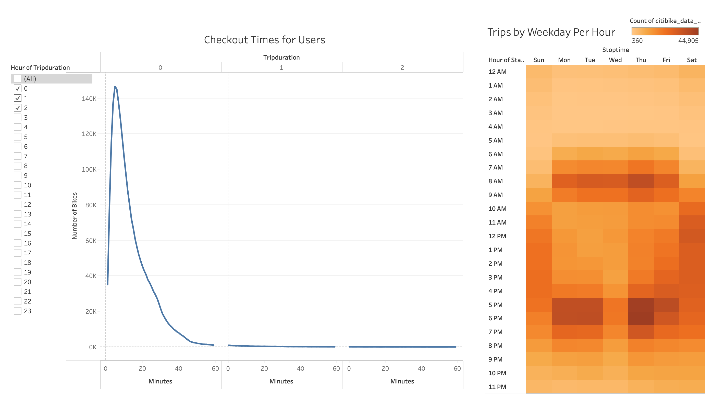
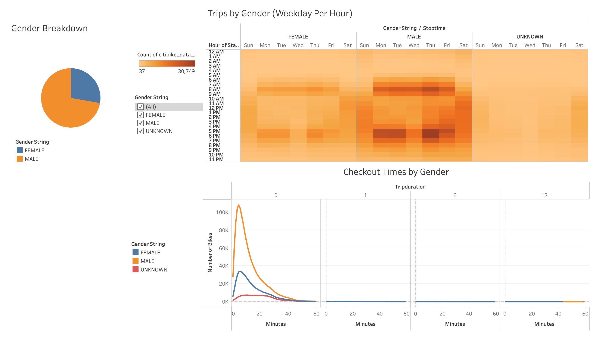
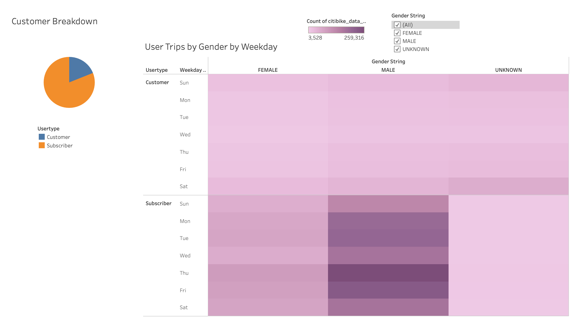

# Bikesharing Analysis

## Overview

### Purpose
Our objective was to analyze CitiBike's bikesharing data from August 2019 in New York City in order to prepare enticing visualizations to help argue that a bikesharing company could be successful in Des Moines, Iowa. 

### Resources
- Data: [Citibike Trip Data 08-2019](https://s3.amazonaws.com/tripdata/201908-citibike-tripdata.csv.zip)
- Software: Tableau Public, VS Code
- [Tableau Public Link]()

## Project Results

### Quick Overview

##### Checkout Times for Users
A majority of trips take less than 30 minutes. The trip duration that occurred the most frequently was just 5 minutes.

##### Trips by Weekday Per Hour
The busiest times appear to be the hours that would be associated with travelling to and from work as well as midday on the weekends.

### Gender Influence

##### Gender Breakdown
Almost 75% of trips are taken by `males`. 

##### Checkout Times by Gender
`Male` and `Female` checkout times follow the same pattern as all users.
`Unknown` genders have almost a consistent amount of trips with durations between 6 and 25 minutes. These data points could be attributed to tourists.

##### Trips by Gender (Weekday Per Hour)
`Male` and `Female` both reflect that the busiest times are during hours travelling to and from work.
`Unkown` genders look to take trips most frequently on the weekend. Again leading to the potential association of tourists.

### Customer vs Subscriber Breakdown

##### Customer Breakdown
We see that around 80% of trips are taken by `subscribers`.

##### User Trips by Gender by Weekday
`Subscribers` are the highest volume users, and their most frequent trip days are Monday-Friday.

## Summary

### Conclusion
The data points to a lot of the CitiBike users being working professionals which had not been considered at the beginning of this analysis. The business idea and analysis should be pivoted to target working professionals as opposed to tourists.

### Next Steps
1. Another heatmap, such as Trips by Age (Weekday Per Hour), would allow us to further reinforce that the working professional demographic should be the new target customer.
2. We need to start looking at Des Moines, Iowa. The ideal locations for our bike stations will be where there are tourist sites amongst large office buildings.